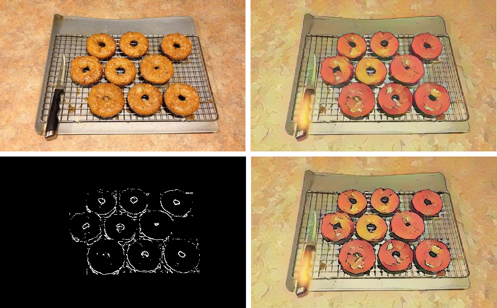
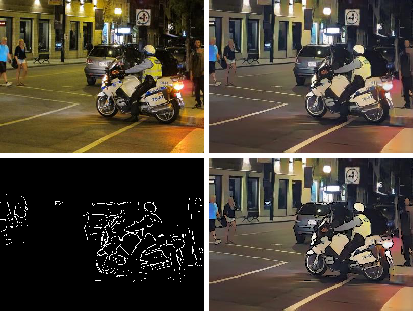

# Anima: Object-Aware Cartoonization

An object-aware cartoonization method using CartoonGAN and Mask R-CNN.

## Description

We took inspiration from CartoonGAN which transforms images into Japanese anime
style. It generates very pleasing scenery but presents objects too realistically.
This is also the same case for a few of the other similar methods. So, we would
like to propose an object-aware cartoonization method based on CartoonGAN with
Mask R-CNN for object detection.

## Installation

1. Clone this repository

2. Run setup from the repository root directory

   ```bash
   bash setup.sh
   ```

3. Start Python virtual environment

   ```bash
   source ./venv/bin/activate
   ```

4. Download pre-trained weights inside the root directory from [here](https://github.com/matterport/Mask_RCNN/releases/download/v2.0/mask_rcnn_coco.h5)

## Usage

### Windowed User Interface

Use `UIControl.py` to initiate the application. It provides a simple interactive
way to input and transform image, as well as visualizing input and output images
side by side. However, it does not mirror all the functionalities of the command
line interface.

```bash
python UIControl.py
```

### Command Line Interface

Use `driver.py` to perform image cartoonization. By default, it will apply
`shinkai` style transfer with `adaptive` edge enhancement on images from
`input` directory, the cartoonized images will be placed in `output` directory.

There are 4 styles available (from CartoonGAN):

- `shinkai`
- `hayao`
- `hosoda`
- `paprika`

There are 3 edge enhancement available:

- `adaptive`
- `canny`
- `morph`

There are many customization options available. As an example, the following
command specified styles, edges, input image, and output directory:

```bash
python driver.py \
  --styles shinkai hayao \
	--edges adaptive canny \
	--input ./input/default.jpg \
	--output_dir ./output
```

To explore all available customization options, please use the following command
to get detailed explainations:

```bash
python cartoonize.py --help
```

## Sample Results

For each set of results:
- The top-left image is the original image
- The top-right image is the result from CartoonGAN
- The bottom-left image is the enhanced stroke mask
- The bottom-right image is the result of our application





## Acknowledgement

- [CartoonGAN-TensorFlow2](https://github.com/mnicnc404/CartoonGan-tensorflow)
- [Mask R-CNN for Object Detection and Segmentation using TensorFlow 2.0](https://github.com/ahmedfgad/Mask-RCNN-TF2)
